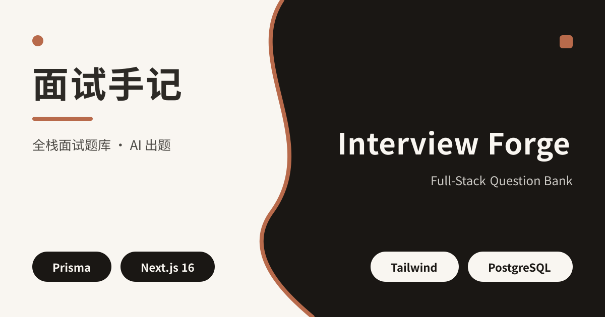
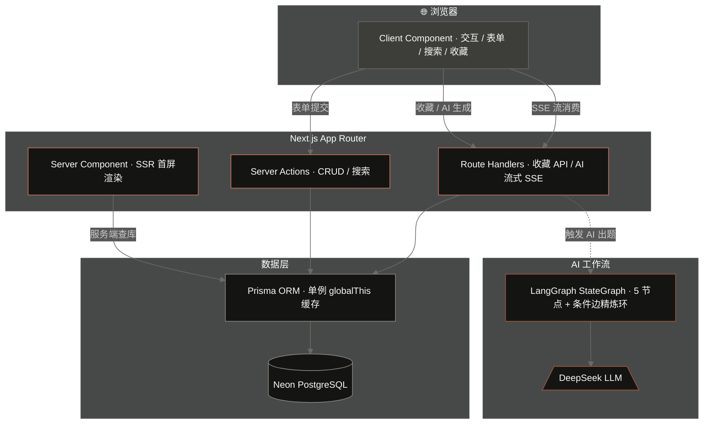
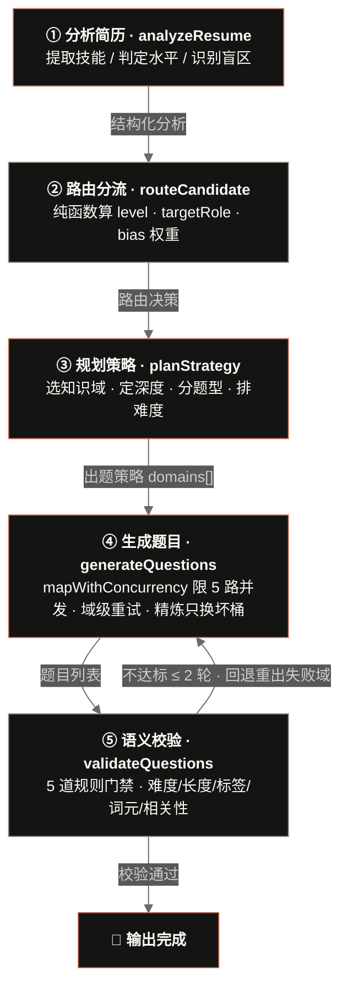

# Interview Forge（面试锻造）

**一个全栈面试题库管理平台——从题库 CRUD（增删改查）到 AI 智能出题，打通 Next.js + Prisma + PostgreSQL 全链路。**




---

## 一、这是什么

面试准备最怕两件事：题库散落在各处找不到，以及不知道面试官会针对自己的简历问什么。

Interview Forge（面试锻造）解决这两个问题：

- **统一收纳**：把你收集的面试题、自己踩过的坑、AI（人工智能）生成的针对性题目，全部存进一个可搜索、可打标签、可收藏的题库里。
- **AI 智能出题**：输入你的简历和目标岗位 JD（Job Description，职位描述），系统自动分析你的技术栈和盲区，生成针对你个人的面试题目——不是泛泛的"请说说闭包"，而是结合你简历里的具体技术点，追问它的设计考量、底层原理与真实踩坑场景。

技术定位：这是一个**资深前端工程师的全栈实践项目**，用 Next.js App Router（应用路由）打通前后端全链路，AI 部分用 LangGraph.js（LangGraph 编排框架）编排工作流而非简单调 API（应用程序接口）。

---

## 二、功能一览

| 功能       | 说明                                                                                                                    |
| -------- | --------------------------------------------------------------------------------------------------------------------- |
| 📝 题库管理  | 新增、编辑、删除题目，Zod（类型校验库）服务端校验，标签多对多关联                                                                                    |
| 🏷️ 标签系统 | 独立标签管理页，题目与标签通过中间表多对多关联                                                                                               |
| ⭐ 收藏     | TanStack Query（查询库）驱动，乐观更新（optimistic update），切换收藏即时响应                                                                |
| 🔍 搜索    | 后端连库模糊搜索（标题 + 正文 + 标签），300ms 防抖（debounce），竞态守卫（race condition guard）防错乱                                                    |
| 🤖 AI 出题 | 输入简历 + JD（职位描述），LangGraph.js（LangGraph 编排框架）编排 5 节点工作流，DeepSeek（深度求索大模型）生成针对性题目，SSE（Server-Sent Events，服务端推送事件）流式推送进度 |
| 🌓 深色模式  | CSS 变量全站换肤，防闪白 FOUC（Flash of Unstyled Content），localStorage（浏览器本地存储）持久化                                               |

### 页面讲解（路由 → 作用）

| 路由                      | 页面 / 作用                                                                          |
| ----------------------- | ---------------------------------------------------------------------------------- |
| `/`                     | 首页：Server Component（服务端组件）SSR（服务端渲染）查库渲染题目列表，顶部搜索框触发后端连库模糊搜索           |
| `/questions/new`        | 新增题目：Zod 校验表单，Server Action（服务端动作）写库                                              |
| `/questions/[id]`       | 题目详情：Markdown 渲染答案（react-markdown + remark-gfm），含编辑/删除/收藏操作                      |
| `/questions/[id]/edit`  | 编辑题目：与新增共用 `QuestionForm`，回填已有数据                                                |
| `/favorites`            | 收藏页：TanStack Query 拉取收藏列表，乐观更新切换收藏状态                                                |
| `/tags`                 | 标签管理：标签增删 + 颜色，题目与标签多对多关联                                                |
| `/ai-generate`          | AI 出题：输入简历 + JD，SSE 流式消费 5 节点工作流进度，实时展示生成题目并一键保存                          |
| `/unlock`               | 密码门：仅**生产环境**且设置 `SITE_PASSWORD` 时才启用（开发环境全开放），输入密码后放开全站访问                          |

---

## 三、快速开始

### 前置要求

- Node.js 18+
- PostgreSQL（关系型数据库，推荐 [Neon](https://neon.tech) 免费套餐）
- DeepSeek API Key（DeepSeek 大模型密钥，[获取地址](https://platform.deepseek.com/api_keys)），可选——不用 AI 出题功能的话可以不填

### 本地运行

```bash
# 1. 克隆项目
git clone https://github.com/ForceNiu/interview-forge.git
cd interview-forge

# 2. 安装依赖（自动执行 prisma generate）
npm install

# 3. 准备环境变量：复制示例并填入真实值
cp .env.example .env
#   编辑 .env，至少填 DATABASE_URL / DEEPSEEK_API_KEY / API_KEY_ENCRYPTION_SECRET
#   详见 .env.example 中的注释说明

# 4. 初始化数据库（仓库已带 migrations，用 migrate deploy 建表）
npx prisma migrate deploy

# 5. 启动开发服务器
npm run dev
```

打开 <http://localhost:3000>，开始使用。

> **提示**：本地若不需要 AI 出题，可跳过 `.env` 里的 `DEEPSEEK_API_KEY` 和 `API_KEY_ENCRYPTION_SECRET`（后端会回退本地 Key 兜底或提示页面填写）；但**部署到 Vercel 时 `API_KEY_ENCRYPTION_SECRET` 必须设**（见部署节），否则使用者填 Key 会失败。

### 种子数据（seed data）

```bash
# 导入 15 道示例前端面试题（可选）
node scripts/seed.cjs
```

---

## 四、技术栈

| 层                      | 技术                                          |
| ---------------------- | ------------------------------------------- |
| 框架（framework）          | Next.js 16 (App Router，应用路由)                |
| 语言（language）           | TypeScript (strict，严格模式)                    |
| ORM（对象关系映射）            | Prisma 6                                    |
| 数据库（database）          | PostgreSQL (Neon 云托管)                       |
| 样式（styling）            | Tailwind CSS v4                             |
| 状态管理（state management） | TanStack Query（服务端状态） + useState（客户端状态）     |
| 表单（form）               | useActionState + Server Actions（服务端动作）      |
| 校验（validation）         | Zod（服务端校验库）                                 |
| AI 编排（orchestration）   | LangGraph.js                                |
| AI 模型（model）           | DeepSeek (deepseek-v4-flash)                |
| 流式输出（streaming）        | SSE（Server-Sent Events，服务端推送事件）             |
| 测试（testing）            | Jest + React Testing Library（RTL，React 测试库） |
| CI/CD（持续集成/持续部署）       | GitHub Actions → Vercel                     |
| 部署（deployment）         | Vercel                                      |

---

## 五、项目结构

```
src/
├── app/                      # Next.js App Router（应用路由）页面与路由
│   ├── page.tsx              # 首页（Server Component，服务端组件，SSR 查库渲染）
│   ├── layout.tsx            # 根布局（QueryProvider 全局查询管理器 + 防闪白脚本）
│   ├── SearchableQuestions.tsx  # 搜索 + 题目列表（Client Component，客户端组件）
│   ├── questions/
│   │   ├── new/page.tsx      # 新增题目页
│   │   └── [id]/
│   │       ├── page.tsx      # 题目详情页（Markdown 渲染）
│   │       └── edit/page.tsx # 编辑题目页
│   ├── favorites/page.tsx    # 收藏页（TanStack Query）
│   ├── tags/page.tsx         # 标签管理页
│   ├── ai-generate/page.tsx  # AI 出题页（SSE 流式消费）
│   ├── unlock/page.tsx       # 密码门页（SITE_PASSWORD 启用时）
│   └── api/
│       ├── ai/
│       │   ├── generate/route.ts    # AI 出题主接口（SSE 流式）
│       │   ├── save-questions/route.ts  # 保存 AI 生成的题目
│       │   ├── setup-key/route.ts   # 加密存储用户 API Key
│       │   ├── test/route.ts        # API Key 连通性测试
│       │   ├── graph-order/route.ts # 工作流节点顺序演示（教学用）
│       │   └── workflow-test/route.ts # 工作流全链路连通性测试
│       └── questions/
│           ├── route.ts             # 返回全部题目 + 可选 favorite 过滤
│           └── [id]/favorite/route.ts  # 切换收藏状态
├── actions/
│   ├── questions.ts           # 题库 Server Actions（CRUD + 搜索）
│   ├── tags.ts               # 标签 Server Actions
│   └── unlock.ts             # 密码门 Server Action
├── components/
│   ├── QuestionForm.tsx       # 新增/编辑共用表单
│   ├── FavoriteButton.tsx     # 收藏按钮（乐观更新）
│   ├── DeleteButton.tsx       # 删除按钮（二次确认 + 淡出动画）
│   ├── QueryProvider.tsx      # TanStack Query 全局 Provider（管理器）
│   ├── ThemeToggle.tsx        # 深色模式切换
│   ├── NavBar.tsx             # 导航栏
│   ├── MarkdownView.tsx       # Markdown 渲染（react-markdown + remark-gfm）
│   └── ui/                    # 手搓 shadcn/ui 基础组件（button/card/input/...）
├── lib/
│   ├── prisma.ts              # Prisma 单例（singleton，globalThis 缓存防连接耗尽）
│   ├── validator.ts           # Zod schema（校验规则定义） + 语义校验函数
│   ├── useDebounce.ts         # 防抖 hook（useDebounce）
│   ├── crypto.ts              # AES-256-GCM 加解密
│   └── ai/
│       ├── workflow.ts        # LangGraph 5 节点工作流定义
│       ├── client.ts          # DeepSeek LLM（大模型）客户端
│       ├── logger.ts          # L1/L2 日志
│       └── recordRun.ts       # L4 运行记录写库
├── __tests__/                 # 组件 / 页面 / Server Actions / 路由测试
│   ├── QuestionForm.test.tsx
│   ├── QuestionList.test.tsx
│   ├── questions.test.tsx
│   ├── tags.test.tsx
│   ├── proxy.test.tsx         # 密码门 proxy 分支
│   ├── unlock.test.tsx        # 解锁 Server Action
│   ├── favorite-route.test.tsx  # 收藏切换路由
│   └── ai/workflow.test.tsx
├── lib/
│   ├── __tests__/             # 纯函数 / 工具类测试
│   │   ├── crypto.test.tsx
│   │   ├── search-ui.test.tsx
│   │   └── validator.test.tsx
│   ├── search-ui.tsx          # 搜索摘要 / 高亮纯函数
│   └── ...
prisma/
├── schema.prisma              # 5 张表定义（数据模型）
scripts/
├── seed.cjs                   # 种子数据
└── smoke.cjs                  # 冒烟测试（smoke test）
```

---

## 六、架构概览



**关键设计**：

- **Server Component（服务端组件）**&#x8D1F;责首屏查库渲染（SSR，服务端渲染），数据作为 props（属性）传给 Client Component（客户端组件）。
- **Server Action（服务端动作）**（`"use server"` 标记的函数）处理写操作——前端直接调服务端函数，Next.js 自动序列化参数/返回值，无需手写 API Route（API 路由）。
- **Route Handler（路由处理）**&#x5904;理需要长连接的场景（SSE 流式输出、RESTful 收藏接口）。
- **Prisma 单例**：通过 `globalThis` 缓存实例，防止 Next.js 热重载（HMR，Hot Module Replacement）重复创建耗尽数据库连接。

---

## 七、AI 工作流

AI 出题不是简单调一次 API。它是一套 **5 节点 LangGraph 工作流（Workflow）**，带自我优化闭环：



| 节点                        | 做什么                                            | 调 LLM（大模型）？ |
| ------------------------- | ---------------------------------------------- | ----------- |
| ① analyzeResume（分析简历）     | 从简历提取技术栈、技能、项目经验、水平、盲区                         | ✅           |
| ② routeCandidate（路由分流）  | 纯函数算 level（水平）/ targetRole（目标角色）/ 题型权重         | ❌           |
| ③ planStrategy（规划策略）      | 根据分析结果规划出题策略（哪些域、各几道、什么题型）                     | ✅           |
| ④ generateQuestions（生成题目） | 各知识域限 5 路并发调用 LLM 出题（mapWithConcurrency(limit=5)），域内自带重试 | ✅           |
| ⑤ validateQuestions（语义校验） | 确定性规则校验（难度范围/长度/标签/开放式词元/相关性）                  | ❌           |

> 📄 自动出题的 3 段提示词（Prompt，提示词）逐段原文介绍与设计方案（LLM（大模型）/ 确定性代码分工、10 个知识域分类、三层追问框架、错误回灌精炼环等），详见 [docs/ai-workflow/AI出题提示词设计.md](docs/ai-workflow/AI出题提示词设计.md)。

**关键工程决策**：

- **路由分流不调 LLM**（节点 ②）：输入已是结构化对象，纯函数可复现、不漂移、省 token（大模型计费单位）。
- **校验不靠 LLM 自评**（节点 ⑤）：LLM-as-Judge（大模型当评委）有位置/冗长/自我增强等已知偏差，且对 prompt 敏感、主观任务一致率下降，用确定性规则当硬门禁更可控。
- **域级重试不连坐**：只重出失败的域（"只换坏桶"），已成功的域不动。
- **精炼环（refine loop）硬上限**：最多 2 轮回退重出，保证必终止。
- **并行扇出（parallel fan-out）**：代码真并发、域级解耦可单独重试；但实际仅生成 5-6 题、端到端受最慢域延迟主导，收益有限（DeepSeek flash 并发上限 2500，本项目同时仅发数个请求碰不到，非瓶颈）。

> **模式归属**：这是 **Workflow（工作流）**——预定代码路径编排（路由/并行/评估器-优化器），不是自主 Agent（智能体）。我把"需可控环节"从 LLM 拿回确定性代码。

---

## 八、数据模型

5 张表，核心关系：

```
User（用户）──< Question（题目）──< QuestionTag（题目-标签关联）>── Tag（标签）

GenerationRun（AI 出题运行记录，独立表）
```

| 表                    | 说明                                     |
| -------------------- | -------------------------------------- |
| User（用户）             | 用户（单用户，userId 由 prisma.user.findFirst()/upsert 动态取，非硬编码）      |
| Question（题目）         | 题目（标题/正文 Markdown/难度/来源/收藏标记/是否 AI 生成） |
| Tag（标签）              | 标签（名称/颜色，名称唯一）                         |
| QuestionTag（题目-标签关联） | 多对多关联表（复合主键 questionId + tagId）        |
| GenerationRun（出题记录）  | AI 出题运行记录（runId/状态/出题数/失败域/精炼轮次/日志）    |

模型文件：[prisma/schema.prisma](prisma/schema.prisma)

---

## 九、测试与 CI/CD（持续集成/持续部署）

### 测试

```bash
# 类型检查（type-check）
npm run type-check

# 单元测试 + 组件测试
npm test
```

当前覆盖 11 个测试套件（约 50 条用例）：表单/列表组件、AI 工作流、搜索与标签下钻逻辑、标签/题目表单校验、安全路径（密码门 / API Key 加密）、收藏切换 API。所有用例均不依赖真实数据库（prisma 全程 mock），可在任意环境稳定跑。

### CI（持续集成）三道闸门

每次 push（推送）到 `main` 分支，GitHub Actions（GitHub 自动化流水线）自动执行：

1. **type-check**（`tsc --noEmit`）——零类型错误才放行
2. **test**（`jest`）——全部用例通过才放行
3. **build**（`next build`）——连 `DATABASE_URL` 预渲染，构建失败则部署中断

> 说明：CI 的 `build` 步骤已开启，需仓库配置 `DATABASE_URL` 这个 GitHub Secret（独立 Neon 库连接串）——因为 provider 为 PostgreSQL，build 时需连库预渲染部分页面。若未配该 Secret，`build` job 会失败（属预期，不是代码问题）。部署侧（Vercel）同样会配 `DATABASE_URL` 在部署时 build 验证。

### 部署（deployment）—— Vercel

1. 在 Vercel 导入 GitHub 仓库 `ForceNiu/interview-forge`，`main` 分支自动生产部署。

   > ⚠️ **构建命令（必设）**：项目已提供 `vercel-build` 脚本（`prisma migrate deploy && npm test && next build`）。请在 Vercel 后台 → 项目 → **Settings → Build & Output → Build Command** 填 `npm run vercel-build`。这样**部署前会自动跑单测，测试不通过则构建失败、不会上线**——避免带 bug 的代码被部署出去。若此处是 `next build` 或默认的 `prisma migrate deploy && next build`，则**没有测试门禁**，请务必改成 `npm run vercel-build`。

   > 📌 **数据库隔离（重要）**：请为展示仓创建一个**全新的、独立的 Neon 项目**，使用它自己的 `DATABASE_URL`——**不要复用你真实生产环境的数据库**。`interview-forge` 是公开 demo，会建表并写入演示数据；连真实库会污染你的真实题库，也违背「公开 demo 不连真实数据」的初衷。

   > 📌 **注（作者开发实例）**：上述「独立 Neon 库」建议仅面向**部署本 demo 的第三方使用者**。作者本人的开发实例中，本地（`npm run dev`）与生产（Vercel 部署）**共用同一个云端 PostgreSQL 实例**以保证数据一致——这是个人项目的开发便利，并非推荐部署者照搬。

2. 配置环境变量（Vercel 后台 → 项目 → **Settings → Environment Variables → 逐条 Add**）：

| 变量名 | 必设？ | 说明 | 取值 |
| --- | --- | --- | --- |
| `DATABASE_URL` | ✅ 必设 | 你**独立新建**的 Neon 项目连接串（不要复用真实生产库） | 从新建的 Neon 项目控制台复制（需含 `?sslmode=require`） |
| `SITE_PASSWORD` | 建议设 | 站点访问密码门（**部署者控制谁能进**） | 自定任意字符串；**不设则全站开放** |
| `API_KEY_ENCRYPTION_SECRET` | ✅ 必设 | 加密使用者填写的 DeepSeek Key（AES-256-GCM 密钥） | 本地执行 `openssl rand -hex 32` 生成（64 位 hex）；**不设则使用者填 Key 时报错** |
| `DEEPSEEK_API_KEY` | ❌ **不要设** | 部署者不提供 Key | **留空**——每位访客各自在 `/ai-generate` 页面填自己的 DeepSeek Key |

> ⚠️ 三个关键点：
> - **`DEEPSEEK_API_KEY` 不要配**：本项目是「使用者自带 Key」模式——访客在页面填自己的 DeepSeek Key（AES 加密存 httpOnly Cookie），不消耗部署者额度。若部署者也设了它，会退化为「所有人共用部署者 Key」。
> - **`API_KEY_ENCRYPTION_SECRET` 必须设**：使用者填 Key 时由 `setup-key` 路由加密、AI 调用时由 `getApiKey` 解密，缺它会导致填写/使用直接报错。
> - Vercel 部署时 `NODE_ENV` 自动为 `"production"`，密码门与加密逻辑才生效；**本地 `npm run dev` 不设这些也能跑（全开放 + 可用本地 `.env` 的 Key 兜底）**。

3. **首次建表**：仓库已带 Prisma migrations（迁移记录，`prisma/migrations/0001_init`）。在你本地连「为展示仓新建的独立 Neon 库」执行一次：
   ```bash
   # 本地 .env 的 DATABASE_URL 已指向独立库后
   npx prisma migrate deploy
   ```
   （`migrate deploy` 会按迁移历史建表/升级，已建过的表不会重建；首次在空库上它即应用 0001_init。注意：`vercel-build` 脚本里已包含 `prisma migrate deploy`，所以 Vercel 部署时会自动建表/升级——本地这步是可选的保底，并非必须。）

   > 本地改了 `schema.prisma` 想生成新迁移时，用 `npx prisma migrate dev`（会自动建表 + 生成新迁移文件 + 记录历史）；不要把 `migrate deploy` 和 `db push` 混用，二者建表机制不同。

   > 可选：建表后执行 `node scripts/seed.cjs` 注入一套演示题库 + 标签（只写 `Question`/`Tag`/`QuestionTag`，不涉及 `GenerationRun`）。

4. 部署完成后访问站点：
   - 设了 `SITE_PASSWORD` → 先跳到 `/unlock` 输密码进入；
   - 首次用 AI 出题，需在 `/ai-generate` 页面填一次自己的 DeepSeek Key（加密存 30 天，之后免填）。

---

## 十、隐私与安全

| 场景                     | 处理方式                                                |
| ---------------------- | --------------------------------------------------- |
| 用户自备的 DeepSeek API Key | 经 AES-256-GCM（对称加密算法）加密后存 httpOnly Cookie，永不到达前端 JS |
| 开发环境 API Key           | 存 `.env`（环境变量文件）的 `DEEPSEEK_API_KEY`，服务端读取，不上传      |
| 主题偏好                   | 存浏览器 localStorage（本地存储），仅本机生效                       |
| 简历/JD 文本               | 仅在 AI 出题时传给 DeepSeek API，不在服务端持久化存储                 |
| 数据库                    | 所有数据仅存于你的 PostgreSQL 实例                             |

---

## 十一、许可

MIT

---

## 📚 项目文档

本项目随附完整的产品设计、技术方案与 AI 工作流说明，详见 [docs/README.md](docs/README.md)：

| 文档 | 路径 |
| --- | --- |
| 产品说明 | [docs/spec/产品说明.md](docs/spec/产品说明.md) |
| 技术方案设计文档 | [docs/spec/技术方案设计文档.md](docs/spec/技术方案设计文档.md) |
| 详细设计文档 | [docs/spec/详细设计文档.md](docs/spec/详细设计文档.md) |
| 项目需求文档 | [docs/spec/项目需求文档.md](docs/spec/项目需求文档.md) |
| AI 工作流-流程图总览 | [docs/ai-workflow/AI工作流-流程图总览.md](docs/ai-workflow/AI工作流-流程图总览.md) |

> 文档配图见 `docs/screenshots/`（界面截图）与 `docs/ai-workflow/assets/`（流程图 SVG）。
