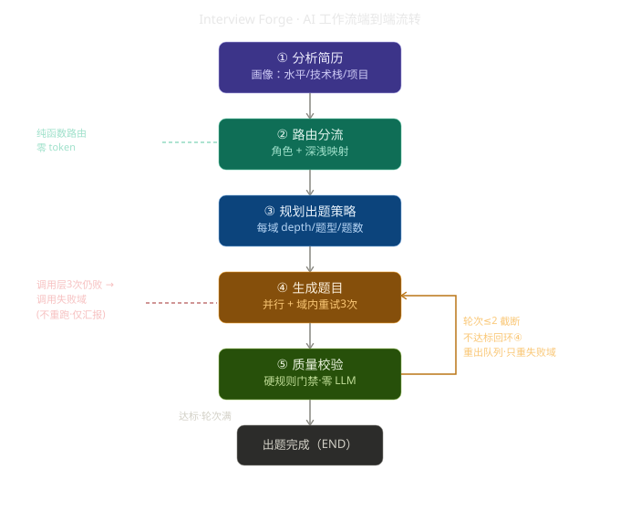
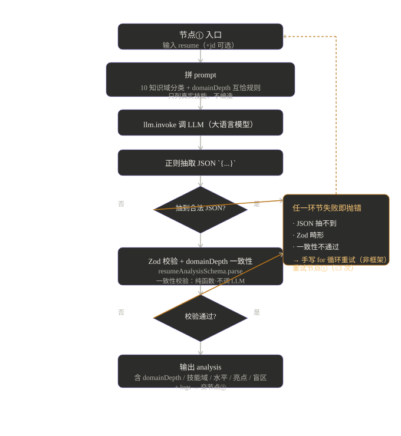
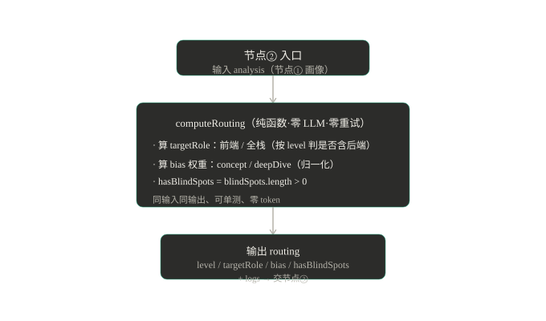
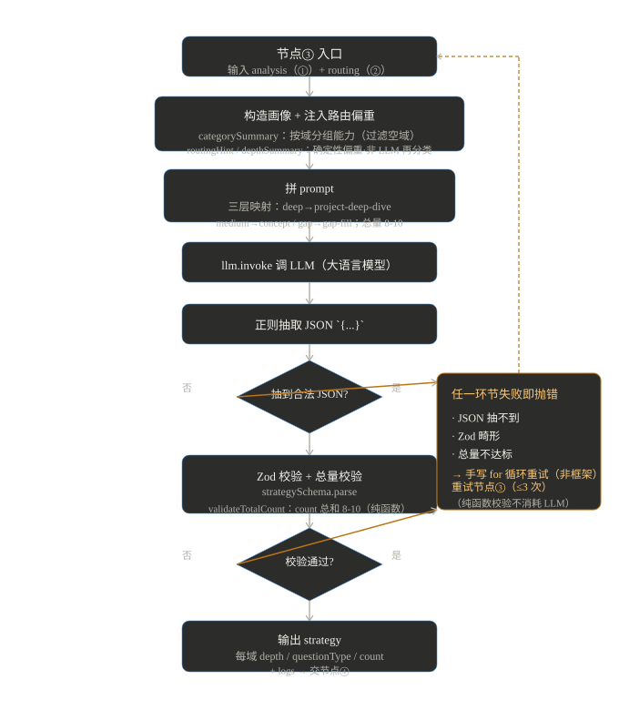
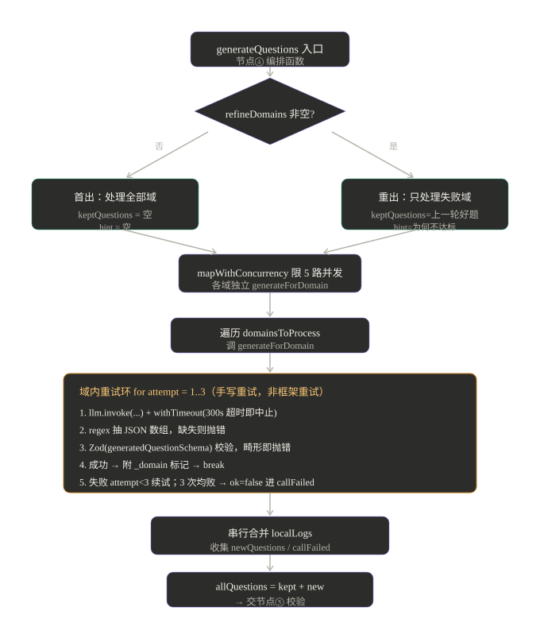
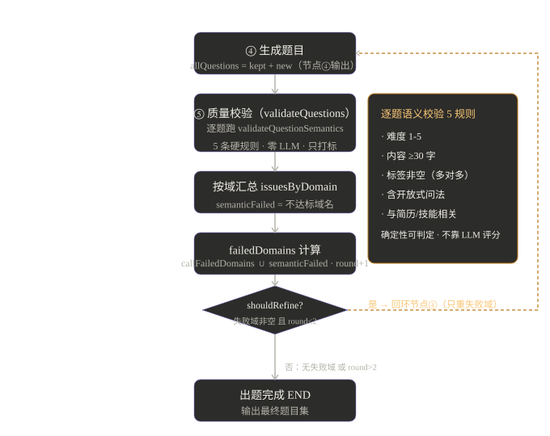

# Interview Forge · AI 工作流流程图总览

> 把 Interview Forge（面试锻造，项目名）的 AI（人工智能）出题工作流「整条链路 + 每个节点」的控制流图集中梳理。
> 技术栈：LangGraph.js 编排 5 个节点，节点①/③/④ 调 LLM（大语言模型），节点②/⑤ 为纯函数/纯规则（零 LLM 调用）。
> 配套讲解文档见 `../personal/AI工作流-节点学习.md`（逐节点速查卡 + 设计决策 + 追问弹药）。

---

## 节点一览（面试速查表）

| 节点 | 函数 | 调 LLM? | 重试机制 | 关键输出 |
|---|---|---|---|---|
| ① 分析简历 | `analyzeResume` | 是 | 手写 for 循环重试（lastErr 回灌，非框架，≤3，JSON/Zod/一致性任一失败） | `analysis`（含 domainDepth / 技能域 / 水平 / 亮点 / 盲区） |
| ② 路由分流 | `routeCandidate` | 否（纯函数） | 无（不会失败） | `routing`（level / targetRole / bias / hasBlindSpots） |
| ③ 规划出题策略 | `planStrategy` | 是 | 手写 for 循环重试（lastErr 回灌，非框架，≤3，JSON/Zod/总量任一失败） | `strategy`（每域 depth / 题型 / 题数，8-10 题） |
| ④ 生成题目 | `generateQuestions` | 是 | 内层域级手写 3 次 + 外层精炼 2 轮 | `questions[]`（带 `_domain` 内部标记） |
| ⑤ 质量校验 | `validateQuestions` | 否（纯规则） | 无（驱动精炼回环，`round<=2` 截断） | `refineDomains` / `failedDomains`（只打标不改题） |

**主线因果**：① 理解候选人 → ② 确定性路由 → ③ 定策略 → ④ 并行出题带两层重试 → ⑤ 零 LLM 硬门禁只打标，把失败域交回④增量重出；靠 `round<=2` + `callFailedDomains` 双锁必终止。

---

## 端到端流转图

---

## 节点① 分析简历（analyzeResume）

- **作用**：LLM（大语言模型）从简历抽画像，输出水平 / 技术栈 / 按域技能 / 各域深浅（domainDepth）/ 项目 / 亮点 / 盲区。
- **关键点**：`domainDepth` 必须与 highlights / blindSpots / projects.depth 逻辑互恰，由纯函数 `validateDomainDepthConsistency` 校验（不调 LLM）。
- **重试**：JSON 抽不到 / Zod（校验库）畸形 / 一致性不通过，任一失败即抛错，由手写 for 循环重试整个节点（lastErr 回灌，非框架，≤3 次）。

---

## 节点② 路由分流（routeCandidate）

- **作用**：纯函数 `computeRouting` 读节点①画像，算角色（前端 / 全栈）+ 深浅权重（concept / deepDive）+ 是否有盲区（hasBlindSpots）。
- **关键点**：零 LLM、零重试；同输入同输出、可单测、零 token（令牌）；把"可控判断"交给确定性函数而非会发散的 LLM（大语言模型）。

---

## 节点③ 规划出题策略（planStrategy）

- **作用**：把节点①画像 + 节点②路由偏重注入 prompt，调 LLM（大语言模型）按三层映射规则产出 `strategy`（每域 depth / 题型 / 题数）。
- **关键点**：三层确定性映射 `domainDepth` → `questionType`：deep→project-deep-dive / medium→concept / gap→gap-fill；总量校验 8-10 题（纯函数 `validateTotalCount`）。
- **重试**：JSON 抽不到 / Zod（校验库）畸形 / 总量不达标，任一失败由手写 for 循环重试（lastErr 回灌，非框架，≤3 次）；纯函数校验本身不消耗 LLM（大语言模型）。

---

## 节点④ 生成题目（generateQuestions）

- **作用**：按节点③策略逐域 `mapWithConcurrency(limit=5)` 限 5 路并发调 LLM（大语言模型）出题；域内手写重试 3 次（应对超时/畸形 JSON）；给题贴 `_domain` 内部标记。
- **两层重试**：内层域级手写 3 次（不挂框架，避免连坐已成功域）；外层精炼环（节点⑤→回环④，最多 2 轮）。
- **增量重出**：保留上一轮好题（`keptQuestions`），只重 `refineDomains`；调用层 3 次仍败的域进 `callFailedDomains` 永久退出精炼环。

---

## 节点⑤ 质量校验（validateQuestions）

- **作用**：确定性语义校验硬门禁，零 LLM（大语言模型）调用；逐题跑 5 条硬规则，不达标域按 `_domain` 聚合成 `refineDomains`。
- **只打标不改题**：重出由节点④负责，保留好题只重失败域。
- **闭环收敛**：`round<=2` 截断 + `callFailedDomains` 永久退出 → 必终止，不撞 Vercel 300s 超时。
